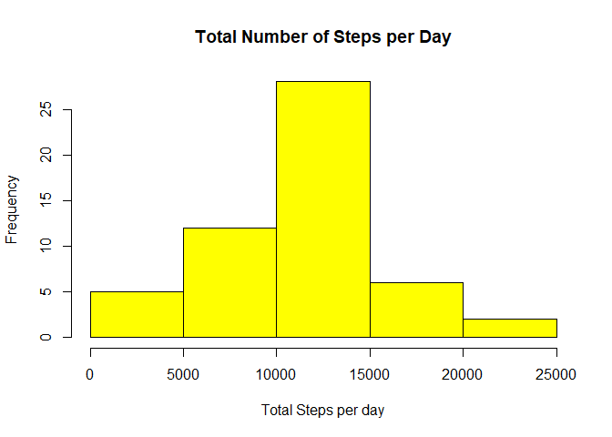
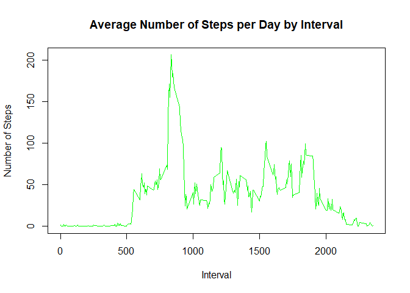
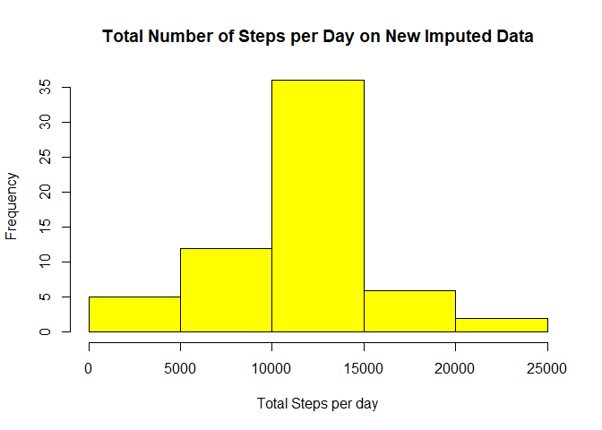
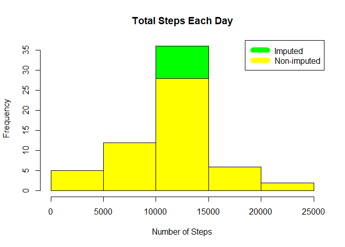

## Loading and preprocessing the data

Packages used are

```r
library(readr)
library(ggplot2)
library(lattice)
```
Unzip the file if the 'activity.csv' file is not exist and run the basic data exploration activites.

```r
if(!file.exists('activity.csv')) {
      unzip(zipfile="activity.zip")
}
```
Used read_csv from readr package insted of read.csv to read the data in correct data type format.

```r
activity_data <- read_csv('activity.csv')
```

```
## Parsed with column specification:
## cols(
##   steps = col_integer(),
##   date = col_date(format = ""),
##   interval = col_integer()
## )
```

```r
dim(activity_data)
```

```
## [1] 17568     3
```

```r
head(activity_data)
```

```
## # A tibble: 6 x 3
##   steps date       interval
##   <int> <date>        <int>
## 1    NA 2012-10-01        0
## 2    NA 2012-10-01        5
## 3    NA 2012-10-01       10
## 4    NA 2012-10-01       15
## 5    NA 2012-10-01       20
## 6    NA 2012-10-01       25
```

```r
tail(activity_data)
```

```
## # A tibble: 6 x 3
##   steps date       interval
##   <int> <date>        <int>
## 1    NA 2012-11-30     2330
## 2    NA 2012-11-30     2335
## 3    NA 2012-11-30     2340
## 4    NA 2012-11-30     2345
## 5    NA 2012-11-30     2350
## 6    NA 2012-11-30     2355
```

```r
str(activity_data)
```

```
## Classes 'tbl_df', 'tbl' and 'data.frame':	17568 obs. of  3 variables:
##  $ steps   : int  NA NA NA NA NA NA NA NA NA NA ...
##  $ date    : Date, format: "2012-10-01" "2012-10-01" ...
##  $ interval: int  0 5 10 15 20 25 30 35 40 45 ...
##  - attr(*, "spec")=List of 2
##   ..$ cols   :List of 3
##   .. ..$ steps   : list()
##   .. .. ..- attr(*, "class")= chr  "collector_integer" "collector"
##   .. ..$ date    :List of 1
##   .. .. ..$ format: chr ""
##   .. .. ..- attr(*, "class")= chr  "collector_date" "collector"
##   .. ..$ interval: list()
##   .. .. ..- attr(*, "class")= chr  "collector_integer" "collector"
##   ..$ default: list()
##   .. ..- attr(*, "class")= chr  "collector_guess" "collector"
##   ..- attr(*, "class")= chr "col_spec"
```

```r
summary(activity_data)
```

```
##      steps             date               interval     
##  Min.   :  0.00   Min.   :2012-10-01   Min.   :   0.0  
##  1st Qu.:  0.00   1st Qu.:2012-10-16   1st Qu.: 588.8  
##  Median :  0.00   Median :2012-10-31   Median :1177.5  
##  Mean   : 37.38   Mean   :2012-10-31   Mean   :1177.5  
##  3rd Qu.: 12.00   3rd Qu.:2012-11-15   3rd Qu.:1766.2  
##  Max.   :806.00   Max.   :2012-11-30   Max.   :2355.0  
##  NA's   :2304
```

Missing Data %

```r
sum(is.na(activity_data$steps))/dim(activity_data)[[1]] * 100
```

```
## [1] 13.11475
```

## What is mean total number of steps taken per day?

1. Calculate the total number of steps taken per day

```r
total_steps_per_day <- aggregate(steps ~ date, activity_data, sum, na.rm = TRUE)
```

2. Make a histogram of the total number of steps taken each day

```r
hist(total_steps_per_day$steps,col = "yellow",xlab = "Total Steps per day",ylab = "Frequency",main = "Total Number of Steps per Day")
```

<!-- -->

3. Calculate and report the mean and median of the total number of steps taken per day
Mean:

```r
mean(total_steps_per_day$steps)
```

```
## [1] 10766.19
```

Median:

```r
median(total_steps_per_day$steps)
```

```
## [1] 10765
```

## What is the average daily activity pattern?

1. Make a time series plot (```type="l"```) of the 5-minute interval (x-axis) and the average number of steps taken, averaged across all days (y-axis)
Average steps for each interval for all days

```r
total_steps_Per_interval<-aggregate(steps~interval, activity_data, mean, na.rm=TRUE)
plot(steps~interval, total_steps_Per_interval, type="l", col = "green", xlab="Interval", ylab="Number of Steps",main="Average Number of Steps per Day by Interval")
```

<!-- -->

2. Which 5-minute interval, on average across all the days in the dataset, contains the maximum number of steps?

```r
total_steps_Per_interval[which.max(total_steps_Per_interval$steps),]$interval
```

```
## [1] 835
```

## Imputing missing values

1. Calculate and report the total number of missing values in the dataset (i.e. the total number of rows with ```NA```s)

```r
sum(!complete.cases(activity_data))
```

```
## [1] 2304
```

```r
sum(is.na(activity_data$steps))
```

```
## [1] 2304
```

```r
sum(is.na(activity_data$date))
```

```
## [1] 0
```

```r
length(which(is.na(activity_data$interval)))
```

```
## [1] 0
```

2. Devise a strategy for filling in all of the missing values in the dataset. The strategy does not need to be sophisticated. For example, you could use the mean/median for that day, or the mean for that 5-minute interval, etc.

```r
getStepsMeanPerInterval <- function(interval) {
      total_steps_Per_interval[total_steps_Per_interval$interval==interval,]$steps
}
```

3. Create a new dataset that is equal to the original dataset but with the missing data filled in.

```r
imputed_activity_data <- activity_data
j <- nrow(imputed_activity_data)
for(i in 1:j) {
      if(is.na(imputed_activity_data[i,]$steps)) {
            imputed_activity_data[i,]$steps <- getStepsMeanPerInterval(imputed_activity_data[i,]$interval)
      }
}
```

Now look for the new data which should not contains any missing data.

```r
sum(is.na(imputed_activity_data$steps))/dim(imputed_activity_data)[[1]] * 100
```

```
## [1] 0
```

```r
sum(!complete.cases(imputed_activity_data))
```

```
## [1] 0
```

```r
head(imputed_activity_data)
```

```
## # A tibble: 6 x 3
##    steps date       interval
##    <dbl> <date>        <int>
## 1 1.72   2012-10-01        0
## 2 0.340  2012-10-01        5
## 3 0.132  2012-10-01       10
## 4 0.151  2012-10-01       15
## 5 0.0755 2012-10-01       20
## 6 2.09   2012-10-01       25
```

```r
tail(imputed_activity_data)
```

```
## # A tibble: 6 x 3
##   steps date       interval
##   <dbl> <date>        <int>
## 1 2.60  2012-11-30     2330
## 2 4.70  2012-11-30     2335
## 3 3.30  2012-11-30     2340
## 4 0.642 2012-11-30     2345
## 5 0.226 2012-11-30     2350
## 6 1.08  2012-11-30     2355
```


4. Make a histogram of the total number of steps taken each day and Calculate and report the mean and median total number of steps taken per day. Do these values differ from the estimates from the first part of the assignment? What is the impact of imputing missing data on the estimates of the total daily number of steps?

```r
total_steps_per_day_new_data <- aggregate(steps ~ date, imputed_activity_data, sum, na.rm = TRUE)
hist(total_steps_per_day_new_data$steps,col = "yellow",xlab = "Total Steps per day",ylab = "Frequency",main = "Total Number of Steps per Day on New Imputed Data")
```

<!-- -->


Depicts Non Imputed vs Imputed

```r
hist(total_steps_per_day_new_data$steps, main = paste("Total Steps Each Day"), col="green", xlab="Number of Steps")
hist(total_steps_per_day$steps, main = paste("Total Steps Each Day"), col="yellow", xlab="Number of Steps", add=T)
legend("topright", c("Imputed", "Non-imputed"), col=c("green", "yellow"), lwd=10)
```

<!-- -->

Mean on New Imputed Data :

```r
mean(total_steps_per_day_new_data$steps)
```

```
## [1] 10766.19
```

Median on New Imputed Data:

```r
median(total_steps_per_day_new_data$steps)
```

```
## [1] 10766.19
```

## Are there differences in activity patterns between weekdays and weekends?

1. Create a new factor variable in the dataset with two levels - "weekday" and "weekend" indicating whether a given date is a weekday or weekend day.

```r
imputed_activity_data$day <- weekdays(imputed_activity_data$date)
for (i in 1:nrow(imputed_activity_data)) {
      if (imputed_activity_data[i,]$day %in% c("Saturday","Sunday")) {
            imputed_activity_data[i,]$day<-"weekend"
      }
      else {
            imputed_activity_data[i,]$day<-"weekday"
      }
}

steps_per_day <- aggregate(imputed_activity_data$steps ~ imputed_activity_data$interval + imputed_activity_data$day, imputed_activity_data, mean)
names(steps_per_day) <- c("interval", "day", "steps")
```

2. Make a panel plot containing a time series plot (i.e. ```type="l"```) of the 5-minute interval (x-axis) and the average number of steps taken, averaged across all weekday days or weekend days (y-axis). See the README file in the GitHub repository to see an example of what this plot should look like using simulated data.

```r
xyplot(steps ~ interval | day, steps_per_day, type = "l", layout = c(1, 2), xlab = "Interval", ylab = "Number of steps")
```

<!-- -->
